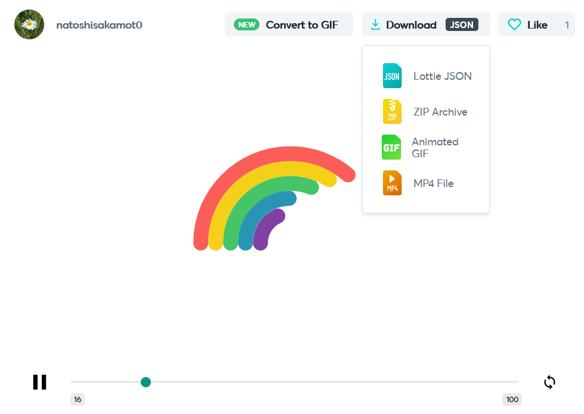

<div style="text-align: center" align="center">
  <h1>Lottie-Web-Vue</h1>
  
  
  [](https://www.npmjs.com/package/lottie-web-vue)
  
  
  [](LICENSE.md)

  > Lottie-web-vue is an Airbnb Lottie-web component for Vue.js projects
</div>

*** 
Airbnb's [Lottie-web](https://github.com/airbnb/lottie-web) is a library for rendering animations exported from Adobe After Effects using the BodyMovin plugin. This package allows you to easily import animation files (available in .json format) into your Vue.js project.

# Vue 3 + Typescript Support
With latest ```lottie-web-vue  2.x.x``` release the library now supports Vue 3 + Typescript typing! If you are using Vue 2.x **ensure to use version 1.2.1** (see below)

```js
npm install lottie-web-vue
```

# Vue 2
Please install ```v1.2.1``` of the plugin. This plugin will focus on maintaining Vue 3 now that it has been officially released.

```js
npm install lottie-web-vue@1.2.1 
```

<br />

# Animations
You can browse and download animations from [LottieFiles](https://lottiefiles.com/). First, find an animation you like > signup > click `export JSON` and save to your project. In vue you can save these under `assets` and then use `require('@/assets/animation.json')` to load them into the `LottieAnimator` as part of the `lottie-web-vue` component.

Example: [https://lottiefiles.com/38726-stagger-rainbow](https://lottiefiles.com/38726-stagger-rainbow)

<p align="center">
  
</p>

<br />
<br />

# Installation
Add lottie-web-vue to your Vue 3.x project package using:
```bash
npm install --save lottie-web-vue
```
or
```
yarn add lottie-web-vue
```

To use Vue 2.x use:
```js
npm install lottie-web-vue@1.2.1 
```

## Vue 2.x
Please install ```v1.2.1``` of the plugin (this will no longer be maintained)
```js
import Vue from 'vue'
import LottieAnimation from 'lottie-web-vue'
 
Vue.use(LottieAnimation); // add lottie-animation to your global scope
 
new Vue({
  render: h => h(App)
}).$mount('#app')
```
<br />

# Usage
Basic:
```html
<script setup lang="ts">
  import { onMounted, ref } from "vue"
  import { LottieAnimation } from "lottie-web-vue"
  import WatermelonJSON from "./assets/watermelon.json"

  let anim = ref()

  onMounted(() => {
    setTimeout(() => {
      console.log(anim.value.goToAndPlay(150, true))
      anim.value
    }, 500)
  })
</script>
<template>
  <LottieAnimation 
    :animation-data="WatermelonJSON"
    :auto-play="true"
    :loop="true"
    :speed="1"
    ref="anim" />
</template>
```

Full available props and events:
```html
<script setup>
  import { onMounted, ref } from "vue"
import { LottieAnimation } from "lottie-web-vue"
import WatermelonJSON from "./assets/watermelon.json"

let anim = ref()

onMounted(() => {
  setTimeout(() => {
    console.log(anim.value.goToAndPlay(150, true))
    anim.value
  }, 500)
})

// called after each loop
const loopComplete = () => {
  console.log('Loop complete')
}

// called after first loop
const complete = () => {
  console.log('First loop complete')
}

// called after first frame entered
const enterFrame = () => {
  console.log('Entered first frame')
}

// called after segment started
const segmentStart = () => {
  console.log('Segment started')
}

// called after animation stopped
const stopped = () => {
  console.log('Stopped')
}
</script>
<template>
  <LottieAnimation
    ref="anim"
    :animation-data="WatermelonJSON"
    :loop="true"
    :auto-play="true"
    :speed="1"
    @loopComplete="loopComplete"
    @complete="complete"
    @enterFrame="enterFrame"
    @segmentStart="segmentStart"
    @stopped="stopped"/>
</template>
```

## Props
The component has a number of props you can use to control the animation playback.

**You must pass animationData** to load the animation prior to the component being played.

### animationData
Type: `Object`<br />
Required: `true`<br />

Include animation data from an import or require statement that imports the `.json` file from your assets folder. e.g. `require('@/assets/animation.json')` (save you animation as a.json file and put under src/assets in your project)

### loop
Type: `[Boolean, Number]`<br />
Required: `false`<br />
Default: `false`

`True`: Animation continously loops
`False`: Animation plays only once
`[number e.g. 3]`: Animation plays N number of times before stopping (pass an integer)

### autoPlay
Type: `Boolean`<br />
Required: `false`<br />
Default: `true`

`True`: Animation will play as soon as it has finished loading
`False`: Animation will play only when you call `this.$refs.lottieAnimation.play()` (see below for playback controls)

### speed
Type: `Number`<br />
Required: `false`<br />
Default: `1`

The speed that the animation will play back.
<br />

## Events
You can listen for events emitted by the component by using the `@` syntax, passing in the parent method you wish to trigger. For more documentation about the Lottie-web events see [here](https://github.com/airbnb/lottie-web#events).

### @loopComplete
Fired once a complete loop of the animation has occurred

### @complete
Fired once the animation has completed (only fired when loop = false)

### @enterFrame
As each frame is played this event is fired. Warning - this fires very frequently.

### @segmentStart
Event is fired when the animation enters each animation segment.

### @stopped
Playing the animation using ```goToAndStop()``` function will raise an event once the animation has stopped at the designated frame.
<br />

## Methods
You can call animation playback methods directly on the component if you wish to trigger playback on an event (i.e. when a user clicks the button, play the animation). You need to use the `this.$refs` syntax and give your LottieAnimation a `ref` id to use in the `this.$refs.[your-name-here]`.

```html
<script setup>
  import { LottieAnimation } from "lottie-web-vue"
  import WatermelonJSON from "./assets/watermelon.json"
</script>
<template>
  <LottieAnimation
    ref="anim"
    :animationData="animation"
  />
</template>
```
Once your component (in the parent view) has a `ref` id you can then use this in a method of your choosing:

```html
... // in your parent .vue file
<script setup lang="ts">
  const buttonClicked = () => {
    this.$refs.anim.play() // .play, .pause, .stop available
  }
</script>
```
### Play
Using `this.$refs.anim.play()` will play the animation. 

### Pause
Using `this.$refs.anim.pause()` will pause the animation. 

### Stop
Using `this.$refs.anim.stop()` will stop the animation. 

### setSpeed [number: speed]
Using ```this.$refs.anim.setSpeed(2)``` you can set the playback speed to ```2```. Default speed is set to 1.
- number: Set the speed playback rate

### goToAndStop [Position: frame number or seconds, isFrame: boolean]
Using ```this.$refs.anim.goToAndStop(10, true``` you can set the specific frame you wish the animation to stop at. Pass in the frame number or seconds to play and if the first value is a frame or a time as true/false. This function will raise an emit (add @stopped="Yourfunction()" to your lottie-animation listen for it).
- position: numeric value (specific frame number or second to stop)
- isFrame: defines if first argument is a time based value or a frame based (default false).

### goToAndPlay [Position: frame number or seconds, isFrame: boolean]
Using ```this.$refs.anim.goToAndPlay(50, true)``` allows you to specify the start time of the animation in either frame number (passing isFrame true/false if value is a frame or in seconds).
- position: numeric value (specific frame number or second to stop)
- isFrame: defines if first argument is a time based value or a frame based (default false).
### setDirection [Direction: -1: reverse, 1: forwards]
Using ```this.$refs.anim.setDirection(-1)``` you can reverse your animation. You can pass in either ```AnimationDirection.``` to reverse the animation or ```1``` to play forwards. Default playback is ```1```.
- Direction:
  - -1 (reverse playback)
  - 1 (play forwards)

### getDuration [inFrames: true/false]
Using ```this.$refs.anim.getDuration(true)``` you can retrieve the current duration of the animation in frames or seconds (false). If you pass true, function returns duration in frames, if false, duration is passed back in seconds. Default is false (returned in seconds).
- inFrames: boolean to request current duration in either frames (inFrames: true) or in seconds (inFrames: false)
### destroy
Using ```this.$refs.anim.destroy()``` you can destroy the animation from the DOM.

<br />

## Options API Example
See here for an example:
```html
<template>
  <div id="app">
    <LottieAnimation
      ref="anim"
      :animationData="require('@/assets/animation.json')"
      :loop="true"
      :autoPlay="true"
      @loopComplete="loopComplete"
      @complete="complete"
      @enterFrame="enterFrame"
    />
  </div>
</template>

<script>
import LottieAnimation from 'lottie-web-vue'

export default {
  components: {
    LottieAnimation
  },
  mounted() {
    this.$refs.anim.play()
  },
  methods: {
    loopComplete() {
      console.log('loopComplete')
    },
    complete() {
      console.log('complete')
    },
    enterFrame() {
      console.log('enterFrame')
    }
  }
}
</script>
```
## Vue 3 Composition API with Setup + Typescript
To use this in a Vue 3 project that uses the ```setup``` Composition API use the following:

### Script setup
```html
<script setup lang="ts">
import { onMounted, ref } from "vue"
import { LottieAnimation } from "lottie-web-vue"
import WatermelonJSON from "./assets/watermelon.json"

let anim = ref()

onMounted(() => {
  setTimeout(() => {
    console.log(anim.value.goToAndPlay(150, true))
    anim.value
  }, 500)
})

</script>
<template>
  <LottieAnimation
    ref="anim"
    :animation-data="WatermelonJSON"
    :loop="true"
    :auto-play="true"
    :speed="1"
    @loopComplete="loopComplete"
    @complete="complete"
    @enterFrame="enterFrame"
    @segmentStart="segmentStart"
    @stopped="stopped"/>
</template>
```
